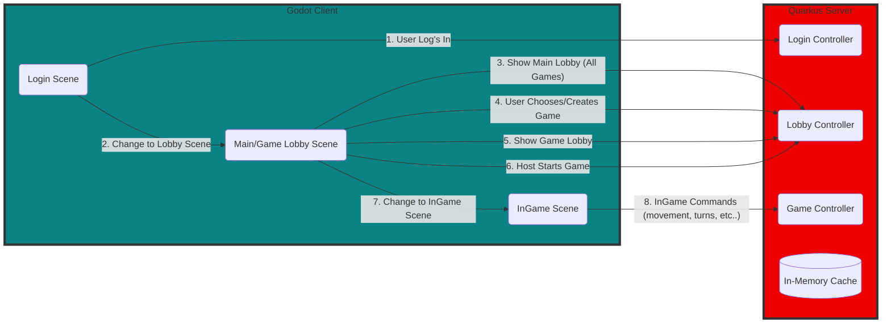

# Introduction

## Quick Background on My Choices

I want to write a real quick (ok not that quick) background on what inspired me to create and document this process. Feel free to skip ahead to the [Architectures section](#architectures), my feelings won't be hurt... too much.

Originally, I wanted to create a simple multiplayer game that was basically a clone of the [Secret Hitler boardgame](https://boardgamegeek.com/boardgame/188834/secret-hitler)(great game). A friend and I actually did create one using NodeJS and Spring but I wanted to update it to be a little more gamey and have some nicer transactions and animations. And I still wanted to be able to deploy my application to a server that was accessible using a normal browser, so I could play with my friends and they would not have to download anything.

### Frontend Choice

While doing some searching online I found [Godot](https://godotengine.org/), which ended up being almost exactly what I was looking for! It has a fairly nice UI that was not to hard to wrap my head around, and it felt easier to keep my code organized than something like Unity. Plus I was able to build my application using HTML5 which is exactly what I wanted. The one issue I found with it was trying to use it as my backend server. I know that it has a lot of [great builtin capabilities](https://docs.godotengine.org/en/stable/tutorials/networking/high_level_multiplayer.html) as a backend server for a Godot frontend. But I found that trying to code business logic using Godot was a little more cumbersome than I would like. Plus I was having issues setting up connections to the mongo database I wanted to use. For that reason I decided to go with a different solution.

### Backend Choice

I have a pretty hefty amount of previous experience using Java in my professional life which is probably why I gravitated to that for my backend. Specifically I have found that the relatively new framework [Quarkus](https://quarkus.io/) works very well as a server and has pretty good documentation online. Full discloser I am a Red Hat Employee (the original developer and main Opensource contributor for Quarkus) but I really do enjoy using it more than Spring at this point. Most importantly though I just find it much easier to organize the code for my business logic than I do in Godot. And it has a lot of existing integration libraries that make things like database connections easier.

### Server Choice

I have played around with a couple different Cloud Technologies in the past, and honestly they all work fine. But while developing this application I started to mess around with [Digital Ocean](https://cloud.digitalocean.com/) and just found it a little easier to parse than some of the other major providers, and the pricing is pretty cheap (it cost about $5 a month to keep up a low powered backend server following this guide. And less if you don't leave the server up and running all the time).

### Communication Choice

The final part I want to mention real quick is the communication between the frontend and backend are done using `Websockets`. More info about how this works can be found in the READMEs below.

# Architectures

Most of the the more technical information can be found in the two repositories README files files. But I want to give a high level architectures picture here.

 > **Note:** It is not super important you understand how any of this actually works for deployment purposes

# Deployment

## Suggested Technologies

All the deployment information is captured in the README files on the repositories which I will link below. My suggestion when trying to deploy these is to deploy locally first. And then try to deploy using `Digital Ocean`. I would also recommend deploying the `backend server` first, as the `frontend server` has some dependencies on it.

## Backend Deployment

Information on the backend deployment can be found on the [Backend's Repositories README](https://github.com/Jaland/godot-lobby-backend)

## Frontend Deployment

Information on the frontend deployment can be found on the [Frontend's Repositories README](https://github.com/Jaland/godot-lobby-frontend)